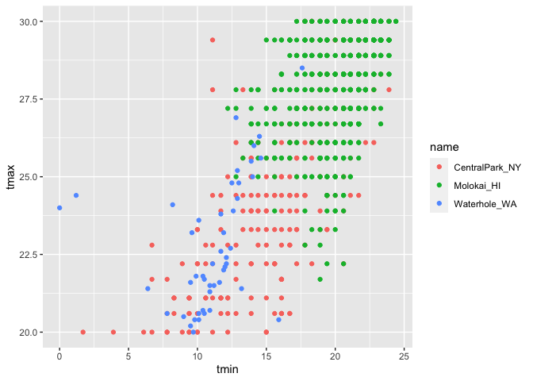
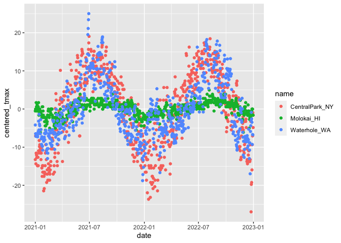

EDA: Numeric Summaries
================

``` r
library(tidyverse)
```

    ## ── Attaching core tidyverse packages ──────────────────────── tidyverse 2.0.0 ──
    ## ✔ dplyr     1.1.3     ✔ readr     2.1.4
    ## ✔ forcats   1.0.0     ✔ stringr   1.5.0
    ## ✔ ggplot2   3.4.3     ✔ tibble    3.2.1
    ## ✔ lubridate 1.9.2     ✔ tidyr     1.3.0
    ## ✔ purrr     1.0.2     
    ## ── Conflicts ────────────────────────────────────────── tidyverse_conflicts() ──
    ## ✖ dplyr::filter() masks stats::filter()
    ## ✖ dplyr::lag()    masks stats::lag()
    ## ℹ Use the conflicted package (<http://conflicted.r-lib.org/>) to force all conflicts to become errors

``` r
library(ggridges)
```

``` r
weather_df = 
  rnoaa::meteo_pull_monitors(
    c("USW00094728", "USW00022534", "USS0023B17S"),
    var = c("PRCP", "TMIN", "TMAX"), 
    date_min = "2021-01-01",
    date_max = "2022-12-31") |>
  mutate(
    name = recode(
      id, 
      USW00094728 = "CentralPark_NY", 
       USW00022534 = "Molokai_HI",
      USS0023B17S = "Waterhole_WA"),
    tmin = tmin / 10,
    tmax = tmax / 10,
  month = lubridate::floor_date(date, unit = "month")) |> 
  select(name, id, everything())
```

    ## using cached file: /Users/cindytseng/Library/Caches/org.R-project.R/R/rnoaa/noaa_ghcnd/USW00094728.dly

    ## date created (size, mb): 2023-09-28 10:20:05.85535 (8.524)

    ## file min/max dates: 1869-01-01 / 2023-09-30

    ## using cached file: /Users/cindytseng/Library/Caches/org.R-project.R/R/rnoaa/noaa_ghcnd/USW00022534.dly

    ## date created (size, mb): 2023-09-28 10:20:11.680677 (3.83)

    ## file min/max dates: 1949-10-01 / 2023-09-30

    ## using cached file: /Users/cindytseng/Library/Caches/org.R-project.R/R/rnoaa/noaa_ghcnd/USS0023B17S.dly

    ## date created (size, mb): 2023-09-28 10:20:13.652989 (0.994)

    ## file min/max dates: 1999-09-01 / 2023-09-30

## Initial numeric work

``` r
weather_df |> 
  ggplot(aes(x = prcp)) +
  geom_histogram()
```

    ## `stat_bin()` using `bins = 30`. Pick better value with `binwidth`.

    ## Warning: Removed 15 rows containing non-finite values (`stat_bin()`).

<!-- -->

here are the big outliers

``` r
weather_df |> 
  filter(prcp > 1000)
```

    ## # A tibble: 3 × 7
    ##   name           id          date        prcp  tmax  tmin month     
    ##   <chr>          <chr>       <date>     <dbl> <dbl> <dbl> <date>    
    ## 1 CentralPark_NY USW00094728 2021-08-21  1130  27.8  22.8 2021-08-01
    ## 2 CentralPark_NY USW00094728 2021-09-01  1811  25.6  17.2 2021-09-01
    ## 3 Molokai_HI     USW00022534 2022-12-18  1120  23.3  18.9 2022-12-01

``` r
weather_df |> 
  filter(tmax >= 20, tmax <= 30) |> 
  ggplot(aes(x = tmin, y = tmax, color = name)) +
  geom_point()
```

<!-- -->

## Grouping

``` r
weather_df |> 
  group_by(name, month) |> 
  summarize(n_obs = n())
```

    ## `summarise()` has grouped output by 'name'. You can override using the
    ## `.groups` argument.

    ## # A tibble: 72 × 3
    ## # Groups:   name [3]
    ##    name           month      n_obs
    ##    <chr>          <date>     <int>
    ##  1 CentralPark_NY 2021-01-01    31
    ##  2 CentralPark_NY 2021-02-01    28
    ##  3 CentralPark_NY 2021-03-01    31
    ##  4 CentralPark_NY 2021-04-01    30
    ##  5 CentralPark_NY 2021-05-01    31
    ##  6 CentralPark_NY 2021-06-01    30
    ##  7 CentralPark_NY 2021-07-01    31
    ##  8 CentralPark_NY 2021-08-01    31
    ##  9 CentralPark_NY 2021-09-01    30
    ## 10 CentralPark_NY 2021-10-01    31
    ## # ℹ 62 more rows

``` r
weather_df |> 
  group_by(month) |> 
   summarize(n_obs = n())
```

    ## # A tibble: 24 × 2
    ##    month      n_obs
    ##    <date>     <int>
    ##  1 2021-01-01    93
    ##  2 2021-02-01    84
    ##  3 2021-03-01    93
    ##  4 2021-04-01    90
    ##  5 2021-05-01    93
    ##  6 2021-06-01    90
    ##  7 2021-07-01    93
    ##  8 2021-08-01    93
    ##  9 2021-09-01    90
    ## 10 2021-10-01    93
    ## # ℹ 14 more rows

``` r
weather_df |> 
  count(name)
```

    ## # A tibble: 3 × 2
    ##   name               n
    ##   <chr>          <int>
    ## 1 CentralPark_NY   730
    ## 2 Molokai_HI       730
    ## 3 Waterhole_WA     730

``` r
weather_df |> 
  count(name, month) |> 
  pivot_wider(
    names_from = name,
    values_from = n
  )
```

    ## # A tibble: 24 × 4
    ##    month      CentralPark_NY Molokai_HI Waterhole_WA
    ##    <date>              <int>      <int>        <int>
    ##  1 2021-01-01             31         31           31
    ##  2 2021-02-01             28         28           28
    ##  3 2021-03-01             31         31           31
    ##  4 2021-04-01             30         30           30
    ##  5 2021-05-01             31         31           31
    ##  6 2021-06-01             30         30           30
    ##  7 2021-07-01             31         31           31
    ##  8 2021-08-01             31         31           31
    ##  9 2021-09-01             30         30           30
    ## 10 2021-10-01             31         31           31
    ## # ℹ 14 more rows

## General summaries

``` r
weather_df |> 
  group_by(name) |> 
  summarize(
    mean_tmax = mean(tmax, na.rm = TRUE)
  )
```

    ## # A tibble: 3 × 2
    ##   name           mean_tmax
    ##   <chr>              <dbl>
    ## 1 CentralPark_NY     17.7 
    ## 2 Molokai_HI         28.3 
    ## 3 Waterhole_WA        7.38

taking mean on tmax

``` r
weather_df |> 
  group_by(name, month) |> 
  summarize(
    mean_tmax = mean(tmax, na.rm = TRUE)
  )
```

    ## `summarise()` has grouped output by 'name'. You can override using the
    ## `.groups` argument.

    ## # A tibble: 72 × 3
    ## # Groups:   name [3]
    ##    name           month      mean_tmax
    ##    <chr>          <date>         <dbl>
    ##  1 CentralPark_NY 2021-01-01      4.27
    ##  2 CentralPark_NY 2021-02-01      3.87
    ##  3 CentralPark_NY 2021-03-01     12.3 
    ##  4 CentralPark_NY 2021-04-01     17.6 
    ##  5 CentralPark_NY 2021-05-01     22.1 
    ##  6 CentralPark_NY 2021-06-01     28.1 
    ##  7 CentralPark_NY 2021-07-01     28.4 
    ##  8 CentralPark_NY 2021-08-01     28.8 
    ##  9 CentralPark_NY 2021-09-01     24.8 
    ## 10 CentralPark_NY 2021-10-01     19.9 
    ## # ℹ 62 more rows

taking median and standard deviation

``` r
weather_df |> 
  group_by(name) |> 
  summarize(
    mean_tmax = mean(tmax, na.rm = TRUE),
    median_tmax = median(tmax, na.rm = TRUE),
    sd_tmax = sd(tmax, na.rm = TRUE)
  )
```

    ## # A tibble: 3 × 4
    ##   name           mean_tmax median_tmax sd_tmax
    ##   <chr>              <dbl>       <dbl>   <dbl>
    ## 1 CentralPark_NY     17.7         18.9    9.96
    ## 2 Molokai_HI         28.3         28.3    1.80
    ## 3 Waterhole_WA        7.38         6.1    7.55

``` r
weather_df |> 
  group_by(name, month) |> 
  summarize(mean_tmax = mean(tmax, na.rm = TRUE)) |> 
  ggplot(aes(x = month, y= mean_tmax, color= name)) +
  geom_point() +
  geom_line()
```

    ## `summarise()` has grouped output by 'name'. You can override using the
    ## `.groups` argument.

<!-- -->

how to pivot wider function and set it like an actual table rather than
a data frame visual

``` r
weather_df |> 
  group_by(name, month) |> 
  summarize(mean_tmax = mean(tmax, na.rm = TRUE)) |> 
  pivot_wider(
    names_from = name, 
    values_from = mean_tmax
  ) |> 
  knitr::kable(digits = 2)
```

    ## `summarise()` has grouped output by 'name'. You can override using the
    ## `.groups` argument.

| month      | CentralPark_NY | Molokai_HI | Waterhole_WA |
|:-----------|---------------:|-----------:|-------------:|
| 2021-01-01 |           4.27 |      27.62 |         0.80 |
| 2021-02-01 |           3.87 |      26.37 |        -0.79 |
| 2021-03-01 |          12.29 |      25.86 |         2.62 |
| 2021-04-01 |          17.61 |      26.57 |         6.10 |
| 2021-05-01 |          22.08 |      28.58 |         8.20 |
| 2021-06-01 |          28.06 |      29.59 |        15.25 |
| 2021-07-01 |          28.35 |      29.99 |        17.34 |
| 2021-08-01 |          28.81 |      29.52 |        17.15 |
| 2021-09-01 |          24.79 |      29.67 |        12.65 |
| 2021-10-01 |          19.93 |      29.13 |         5.48 |
| 2021-11-01 |          11.54 |      28.85 |         3.53 |
| 2021-12-01 |           9.59 |      26.19 |        -2.10 |
| 2022-01-01 |           2.85 |      26.61 |         3.61 |
| 2022-02-01 |           7.65 |      26.83 |         2.99 |
| 2022-03-01 |          11.99 |      27.73 |         3.42 |
| 2022-04-01 |          15.81 |      27.72 |         2.46 |
| 2022-05-01 |          22.25 |      28.28 |         5.81 |
| 2022-06-01 |          26.09 |      29.16 |        11.13 |
| 2022-07-01 |          30.72 |      29.53 |        15.86 |
| 2022-08-01 |          30.50 |      30.70 |        18.83 |
| 2022-09-01 |          24.92 |      30.41 |        15.21 |
| 2022-10-01 |          17.43 |      29.22 |        11.88 |
| 2022-11-01 |          14.02 |      27.96 |         2.14 |
| 2022-12-01 |           6.76 |      27.35 |        -0.46 |

## Grouped mutate

``` r
weather_df |>
  group_by(name) |>
  mutate(
    mean_tmax = mean(tmax, na.rm = TRUE),
    centered_tmax = tmax - mean_tmax) |> 
  ggplot(aes(x = date, y = centered_tmax, color = name)) + 
    geom_point() 
```

    ## Warning: Removed 17 rows containing missing values (`geom_point()`).

<!-- -->

``` r
weather_df |>
  group_by(name, month) |>
  mutate(temp_ranking = min_rank(tmax))
```

    ## # A tibble: 2,190 × 8
    ## # Groups:   name, month [72]
    ##    name           id        date        prcp  tmax  tmin month      temp_ranking
    ##    <chr>          <chr>     <date>     <dbl> <dbl> <dbl> <date>            <int>
    ##  1 CentralPark_NY USW00094… 2021-01-01   157   4.4   0.6 2021-01-01           14
    ##  2 CentralPark_NY USW00094… 2021-01-02    13  10.6   2.2 2021-01-01           31
    ##  3 CentralPark_NY USW00094… 2021-01-03    56   3.3   1.1 2021-01-01           13
    ##  4 CentralPark_NY USW00094… 2021-01-04     5   6.1   1.7 2021-01-01           20
    ##  5 CentralPark_NY USW00094… 2021-01-05     0   5.6   2.2 2021-01-01           19
    ##  6 CentralPark_NY USW00094… 2021-01-06     0   5     1.1 2021-01-01           16
    ##  7 CentralPark_NY USW00094… 2021-01-07     0   5    -1   2021-01-01           16
    ##  8 CentralPark_NY USW00094… 2021-01-08     0   2.8  -2.7 2021-01-01            8
    ##  9 CentralPark_NY USW00094… 2021-01-09     0   2.8  -4.3 2021-01-01            8
    ## 10 CentralPark_NY USW00094… 2021-01-10     0   5    -1.6 2021-01-01           16
    ## # ℹ 2,180 more rows

can also filter

``` r
weather_df |>
  group_by(name, month) |>
  mutate(tmax_rank = min_rank(desc(tmax))) |> 
  filter(tmax_rank < 2 )
```

    ## # A tibble: 104 × 8
    ## # Groups:   name, month [72]
    ##    name           id          date        prcp  tmax  tmin month      tmax_rank
    ##    <chr>          <chr>       <date>     <dbl> <dbl> <dbl> <date>         <int>
    ##  1 CentralPark_NY USW00094728 2021-01-02    13  10.6   2.2 2021-01-01         1
    ##  2 CentralPark_NY USW00094728 2021-02-24     0  12.2   3.9 2021-02-01         1
    ##  3 CentralPark_NY USW00094728 2021-03-26    48  27.8  11.1 2021-03-01         1
    ##  4 CentralPark_NY USW00094728 2021-04-28    13  29.4  11.1 2021-04-01         1
    ##  5 CentralPark_NY USW00094728 2021-05-22     0  31.7  18.3 2021-05-01         1
    ##  6 CentralPark_NY USW00094728 2021-06-30   165  36.7  22.8 2021-06-01         1
    ##  7 CentralPark_NY USW00094728 2021-07-06   140  33.3  21.7 2021-07-01         1
    ##  8 CentralPark_NY USW00094728 2021-08-13     0  34.4  25.6 2021-08-01         1
    ##  9 CentralPark_NY USW00094728 2021-09-15     0  29.4  21.7 2021-09-01         1
    ## 10 CentralPark_NY USW00094728 2021-10-15     0  26.1  17.2 2021-10-01         1
    ## # ℹ 94 more rows

lags used to compare an observation to it’s previous value. This is
useful, for example, to find the day-by-day change in max temperature
within each station over the year

``` r
weather_df |> 
  group_by(name) |> 
  mutate(yesterday_tmax = lag(tmax, 3))
```

    ## # A tibble: 2,190 × 8
    ## # Groups:   name [3]
    ##    name           id      date        prcp  tmax  tmin month      yesterday_tmax
    ##    <chr>          <chr>   <date>     <dbl> <dbl> <dbl> <date>              <dbl>
    ##  1 CentralPark_NY USW000… 2021-01-01   157   4.4   0.6 2021-01-01           NA  
    ##  2 CentralPark_NY USW000… 2021-01-02    13  10.6   2.2 2021-01-01           NA  
    ##  3 CentralPark_NY USW000… 2021-01-03    56   3.3   1.1 2021-01-01           NA  
    ##  4 CentralPark_NY USW000… 2021-01-04     5   6.1   1.7 2021-01-01            4.4
    ##  5 CentralPark_NY USW000… 2021-01-05     0   5.6   2.2 2021-01-01           10.6
    ##  6 CentralPark_NY USW000… 2021-01-06     0   5     1.1 2021-01-01            3.3
    ##  7 CentralPark_NY USW000… 2021-01-07     0   5    -1   2021-01-01            6.1
    ##  8 CentralPark_NY USW000… 2021-01-08     0   2.8  -2.7 2021-01-01            5.6
    ##  9 CentralPark_NY USW000… 2021-01-09     0   2.8  -4.3 2021-01-01            5  
    ## 10 CentralPark_NY USW000… 2021-01-10     0   5    -1.6 2021-01-01            5  
    ## # ℹ 2,180 more rows

This kind of variable might be used to quantify the day-by-day
variability in max temperature, or to identify the largest one-day
increase

``` r
weather_df |> 
  group_by(name) |> 
  mutate(temp_change = tmax - lag(tmax)) |> 
  summarize(
    sd_temp_change = sd(temp_change, na.rm = TRUE)
  )
```

    ## # A tibble: 3 × 2
    ##   name           sd_temp_change
    ##   <chr>                   <dbl>
    ## 1 CentralPark_NY           4.43
    ## 2 Molokai_HI               1.24
    ## 3 Waterhole_WA             3.04
